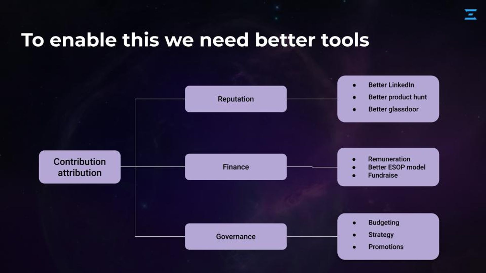

# The coordination stack

We categorised four building blocks to solve some of the mentioned problems in [why\_coordination.md](../../why\_coordination.md "mention")

1. [#attribution-stack](./#attribution-stack "mention") - stores relative contributions of different contributors in an organisation across different guilds
2. \#[financial-stack.md](financial-stack.md "mention") - helps you distribute rewards using attribution-stack in different tokens and create financial auditability
3. [#governance-stack](./#governance-stack "mention") - helps you define decision-making powers using attribution-stack
4. [#fundraise-stack](./#fundraise-stack "mention") - helps you raise funds and define conditions like "how to use funds", "exit conditions", "vesting schedule" etc similar to SHA(shareholding agreement)

We believe these building blocks enable organisations to be scalable and efficient using new tools.

<figure><figcaption>
A slide from Rohit's presentation at Starknet India'23
</figcaption></figure>

